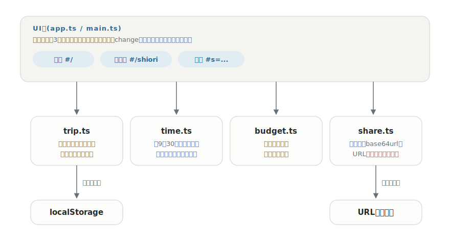

# tabishiori

[](https://github.com/miruky/tabishiori/actions/workflows/ci.yml)
[](https://github.com/miruky/tabishiori/actions/workflows/deploy.yml)

[](LICENSE)

**行程表・持ち物・予算を1枚にまとめた旅のしおりを作り、印刷とURL共有までできるアプリ。**

公開ページ: https://miruky.github.io/tabishiori/

## 概要

tabishioriは家族や友人との旅行前に作る「しおり」をブラウザで組み立てるツールである。日ごとの行程(時刻・種別・予定・補足)、持ち物チェックリスト、費目別の予算を編集画面で入力すると、印刷を前提に組んだ1枚のしおりが出来上がる。しおり全体はURLのハッシュに埋め込んで共有でき、受け取った人はリンクを開くだけで同じしおりを見て、自分の端末に取り込める。

データはブラウザのlocalStorageに保存され、サーバーには何も送らない。共有もサーバーを介さず、しおりのデータそのものをURLに載せる方式をとる。

### なぜ作ったのか

旅行の計画は、行程はメッセージアプリ、持ち物はメモ帳、予算は表計算と、ばらばらの場所に散らばりがちで、出発直前に「結局何時集合だっけ」と全部をさかのぼることになる。紙のしおり1枚の情報密度をそのままに、編集はフォームで、配布はURLで済ませたくて作った。

## アーキテクチャ



UI層はフレームワークなしのTypeScriptで、編集(`#/`)・しおり表示(`#/shiori`)・共有表示(`#s=...`)の3モードをハッシュで切り替える。時刻の解釈、予算の集計、共有データの符号化はDOMに依存しない純粋なモジュールで、そのまま単体テストできる。

## 技術スタック

| カテゴリ             | 技術                                  |
| :------------------- | :------------------------------------ |
| 言語                 | TypeScript 5(strict)                  |
| ビルド               | Vite 6                                |
| テスト               | Vitest                                |
| リンタ・フォーマッタ | ESLint 9 / Prettier                   |
| CI / 配信            | GitHub Actions / GitHub Pages         |
| 永続化・共有         | localStorage / URLハッシュ(base64url) |

## 使い方

### 行程の時刻

時刻はいくつかの書き方を受け付けて「9:05」の形式に揃え、予定を時刻順に並べ直す。時刻を空にした予定は、入力した順のまま日の末尾に置かれる。

| 入力               | 解釈                 |
| :----------------- | :------------------- |
| `9:30`・`09:30`    | 9:30                 |
| `9時30分`・`9時30` | 9:30                 |
| `9時`              | 9:00                 |
| `９：３０`(全角)   | 9:30                 |
| `朝イチ` など      | 時刻なしとして末尾へ |

### 予算

金額は「12,300」「12300円」「¥12,300」のような表記をそのまま受け付けて整数の円にする。費目(交通・宿泊・食事・体験・観光・その他)ごとの小計と合計が自動で出る。

### 共有

しおり表示の「共有リンクをコピー」を押すと、しおり全体をbase64urlで符号化したURLができる。例:

```
https://miruky.github.io/tabishiori/#s=v1.eyJ0aXRsZSI6IuS6rOmDvSDkuozms4rkuInml6Ui...
```

受け取った側はリンクを開くと読み取り専用のしおりが表示され、「自分のしおりとして取り込む」で自分の編集データにできる。リンクを開いただけでは取り込まれない。

### 印刷

しおり表示の「印刷する」でブラウザの印刷ダイアログを開く。画面用の装飾は印刷時に取り除かれ、日のまとまりがページをまたがないよう改ページを制御している。

### 制約

- 同時に持てるしおりは1冊。複数の旅を残したいときは、共有リンクを控えてから作り直す。
- 共有URLはしおりの中身すべてを含むため、行程が長いほどURLも長くなる。
- データは端末のブラウザに保存されるため、端末をまたいだ同期はできない。

## プロジェクト構成

- `index.html` — エントリポイント
- `src/main.ts` — 起動。ストアの初期化と初回の見本データ投入
- `src/app.ts` — 画面の描画と遷移(編集・しおり表示・共有表示)
- `src/icons.ts` — 線画SVGアイコン
- `src/style.css` — デザイントークンとスタイル(ライト・ダーク・印刷対応)
- `src/lib/trip.ts` — しおりの型・検証・日付計算・永続化
- `src/lib/time.ts` — 時刻表記の解釈・正規化・整列
- `src/lib/budget.ts` — 金額の解釈と費目別集計
- `src/lib/share.ts` — 共有URLの符号化・復元
- `src/lib/seed.ts` — 初回起動時の見本のしおり
- `docs/architecture.svg` — 構成図
- `.github/workflows/` — CI(lint・テスト・ビルド)とPagesデプロイ

## はじめ方

### 前提条件

- Node.js 22以上

### セットアップ

```bash
git clone https://github.com/miruky/tabishiori.git
cd tabishiori
npm install
npm run dev
```

### テストの実行

```bash
npm test
```

### Lintの実行

```bash
npm run lint
```

### ビルド

```bash
npm run build
```

GitHub Pagesではリポジトリ名のサブパスで配信されるため、デプロイ時は環境変数 `TABISHIORI_BASE=/tabishiori/` でViteの `base` を切り替える(`.github/workflows/deploy.yml` 参照)。

## 設計方針

- **紙のしおりが完成形** — 画面はあくまで編集の場で、最終出力は印刷した1枚。表示モードは余白・改ページ・単色印刷を前提に組んでいる。
- **サーバーレスの共有** — 共有はしおりのデータそのものをURLに載せる。リンクだけで完結し、保存先が消えてしおりが開けなくなることがない。バージョン札(`v1.`)を付け、将来形式を変えても古いリンクを区別できる。
- **入力は寛容に、保存は厳密に** — 時刻も金額も人が書きがちな揺れ(全角・単位・区切り)を受け付けて正規化する。一方で保存データの復元は型ガードで検証し、壊れたデータを黙って受け入れない。
- **changeイベントで確定** — 入力のたびに再描画すると日本語入力が途切れるため、反映はフォーカスが離れた確定時に行う。

## ライセンス

[MIT](LICENSE)
